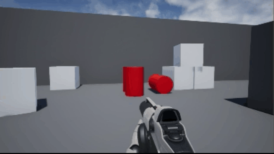

# Unreal Engine 4 - Classic Red Explosive Barrel

This is implementation of classic gameplay element *"Red explosive barrel"*.

Logic created with blueprints. 

Barrel uses UE4 damage system, so damage can be applied by any damage agent.

In `First Person shooter` template you need to implement damage application to object that was hit by projectile.

- Defaut barrel health - 200HP
- Fire starts at less or equal 100HP
- Unreal Engine - `v4.21.2`

## Installation

- You can clone and run this demo project
- Or import [RedExplosiveBarrel](RedExplosiveBarrel.zip) to your project's `Content` 
folder and create barrels from Blueprint class.
